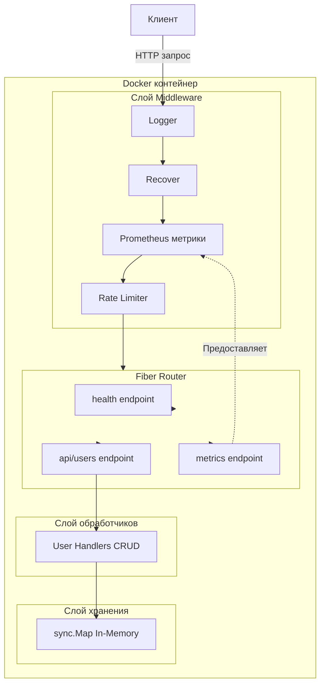

# Go Fiber Микросервис

Высокопроизводительный демонстрационный микросервис, построенный на Go и веб-фреймворке Fiber. Проект демонстрирует best practices для создания production-ready REST API с акцентом на производительность, наблюдаемость и контейнеризацию.

## Почему Fiber?

[Fiber](https://gofiber.io/) — веб-фреймворк, вдохновлённый Express, построенный поверх Fasthttp — самого быстрого HTTP-движка для Go. Ключевые преимущества:

- **Производительность**: до 10x быстрее стандартного Go net/http
- **Низкое потребление памяти**: оптимизирован для высоконагруженных сценариев
- **Express-подобный API**: знакомый синтаксис для быстрой разработки
- **Нулевые аллокации памяти**: эффективный роутинг и middleware

Это делает Fiber отличным выбором для высокопроизводительных микросервисов, где производительность критична.

## Архитектура



## Структура проекта

```
.
├── cmd/
│   └── server/
│       └── main.go              # Точка входа, настройка middleware
├── internal/
│   ├── handler/
│   │   └── user.go              # HTTP обработчики для CRUD операций над пользователями
│   ├── model/
│   │   └── user.go              # Модель домена User и DTO
│   └── storage/
│       └── memory.go            # Реализация in-memory хранилища (sync.Map)
├── Dockerfile                   # Multi-stage сборка с distroless финальным образом
├── docker-compose.yml           # Конфигурация Docker Compose
├── load-testing.js              # Скрипт нагрузочного тестирования k6
├── go.mod                       # Зависимости Go модуля
└── go.sum                       # Контрольные суммы зависимостей
```

### Ключевые компоненты

- **cmd/server/main.go**: Инициализирует Fiber приложение, регистрирует middleware (logger, recovery, метрики, rate limiter) и определяет маршруты
- **internal/handler**: HTTP обработчики запросов с валидацией и обработкой ошибок
- **internal/model**: Структуры данных и объекты передачи
- **internal/storage**: Потокобезопасное in-memory хранилище на основе `sync.Map` для конкурентного доступа
- **Dockerfile**: Multi-stage сборка, создающая минимальный distroless контейнер (~5MB)

## Быстрый старт

### Требования

- Go 1.25+
- Docker & Docker Compose (опционально)
- k6 (для нагрузочного тестирования)

### Локальная разработка

```bash
# Установить зависимости
go mod download

# Запустить сервис
go run ./cmd/server

# Сервис запустится на http://localhost:3000
```

### Docker

```bash
# Собрать и запустить с Docker Compose
docker-compose up --build

# Запустить в фоне
docker-compose up -d --build

# Остановить
docker-compose down
```

## API Endpoints

### Управление пользователями

| Метод | Endpoint | Описание | Тело запроса | Ответ |
|--------|----------|-------------|--------------|----------|
| `GET` | `/api/users` | Получить всех пользователей | - | `200 OK` Массив пользователей |
| `GET` | `/api/users/:id` | Получить пользователя по ID | - | `200 OK` Объект пользователя<br/>`404 Not Found` |
| `POST` | `/api/users` | Создать нового пользователя | `{"name":"string","email":"string"}` | `201 Created` Объект пользователя |
| `PUT` | `/api/users/:id` | Обновить пользователя | `{"name":"string","email":"string"}` | `200 OK` Объект пользователя<br/>`404 Not Found` |
| `DELETE` | `/api/users/:id` | Удалить пользователя | - | `204 No Content`<br/>`404 Not Found` |

### Системные endpoints

| Метод | Endpoint | Описание |
|--------|----------|-------------|
| `GET` | `/health` | Проверка состояния сервиса |
| `GET` | `/metrics` | Метрики Prometheus |

### Примеры запросов

```bash
# Создать пользователя
curl -X POST http://localhost:3000/api/users \
  -H "Content-Type: application/json" \
  -d '{"name":"Иван Иванов","email":"ivan@example.com"}'

# Получить всех пользователей
curl http://localhost:3000/api/users

# Получить пользователя по ID
curl http://localhost:3000/api/users/1

# Обновить пользователя
curl -X PUT http://localhost:3000/api/users/1 \
  -H "Content-Type: application/json" \
  -d '{"name":"Пётр Петров","email":"petr@example.com"}'

# Удалить пользователя
curl -X DELETE http://localhost:3000/api/users/1
```

## Нагрузочное тестирование

Проект включает скрипт k6 для валидации производительности под высокой нагрузкой.

### Что делает тест

- **Setup**: Создаёт 5 тестовых пользователей перед началом теста
- **Нагрузка**: Непрерывно отправляет запросы `GET /api/users`
- **Конфигурация по умолчанию**: 500 одновременных виртуальных пользователей в течение 60 секунд
- **Цель**: Проверить способность сервиса обрабатывать 1000+ RPS

### Запуск нагрузочных тестов

```bash
# Установить k6
brew install k6  # macOS
# или посетить https://k6.io/docs/getting-started/installation/

# Запустить тест с настройками по умолчанию (500 VU, 60s)
k6 run load-testing.js

# Кастомная конфигурация
k6 run --vus 100 --duration 30s load-testing.js

# Другой целевой сервер
BASE_URL=http://example.com:3000 k6 run load-testing.js
```

### Ожидаемая производительность

Результаты нагрузочного тестирования (500 VU, 60 секунд):

- **Пропускная способность**: 30k+ RPS
- **Latency**: 
  - p50 (медиана): 8.25ms
  - p90: 18.08ms
  - p95: 25.76ms
  - p99: не указана, max = 509.96ms
  - Средняя: 10.56ms
- **Процент ошибок**: 0%
- **Успешные проверки**: 100% (2,004,685 из 2,004,685)

## Наблюдаемость

### Метрики

Сервис предоставляет метрики Prometheus на endpoint `/metrics`:

```promql
# Скорость запросов (RPS)
rate(http_requests_total[1m])

# Процентили latency
histogram_quantile(0.95, rate(http_request_duration_seconds_bucket[5m]))

# Процент ошибок
sum(rate(http_errors_total[1m])) / sum(rate(http_requests_total[1m]))
```

**Доступные метрики:**
- `http_requests_total` - Общее количество HTTP запросов (счётчик)
- `http_request_duration_seconds` - Гистограмма latency запросов
- `http_errors_total` - HTTP ошибки (статус >= 400)
- Стандартные метрики Go runtime (goroutines, память, GC)

### Логирование

Структурированные логи в текстовом формате:
```
[2025-12-28 22:30:15] 200 - 1.2ms GET /api/users
[2025-12-28 22:30:15] 201 - 0.8ms POST /api/users
```

## Конфигурация

Переменные окружения:

| Переменная | По умолчанию | Описание |
|----------|---------|-------------|
| `PORT` | `3000` | Порт HTTP сервера |

## Технические детали

### Оптимизации производительности

- **In-Memory хранилище**: `sync.Map` для lock-free чтения в сценариях с высокой конкуренцией
- **Атомарная генерация ID**: `atomic.Uint64` для потокобезопасного инкремента ID
- **Статический бинарник**: CGO отключён для минимальных зависимостей
- **Роутинг без аллокаций**: Оптимизированный роутер Fiber без аллокаций в heap

### Rate Limiting

Реализовано ограничение скорости запросов с использованием встроенного fixed-window rate limiter Fiber. Лимит настраивается в конфигурации middleware.


## Лицензия

Это демонстрационный проект для образовательных целей.
